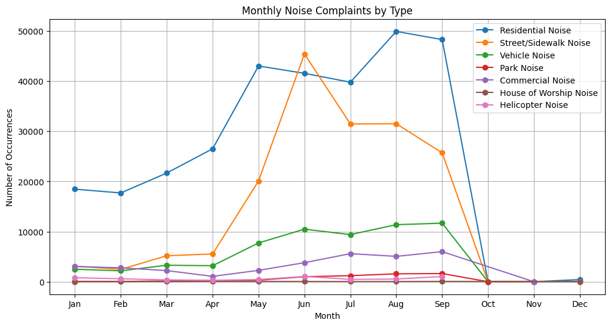
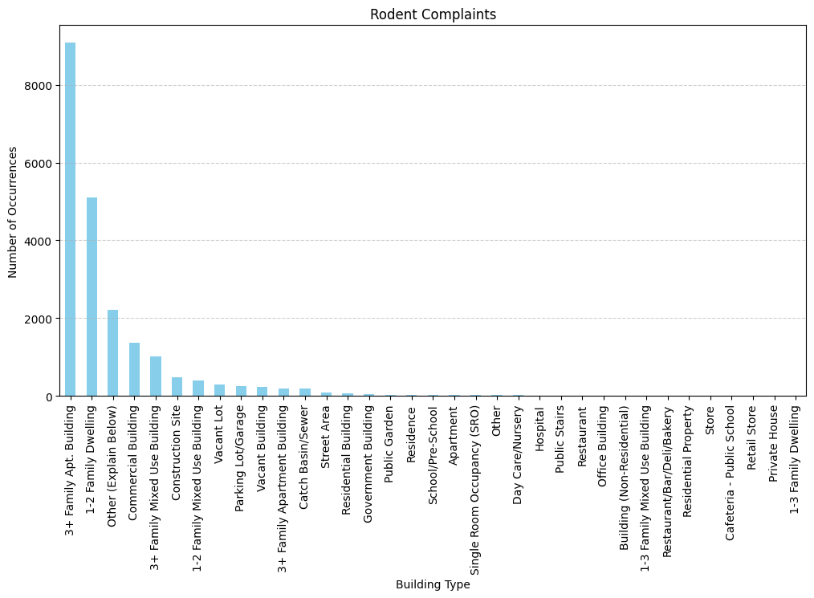

## Description
Analyze NYC public data on complaints made in 2020. This analysis is used to gain a deeper understanding on the Data Science concept of question formulation.

## Noise complaints
The trend showing types different noise complaints per each month of the year 2020.

## Urban rodents
The results showing which building types are more likely to incur sanitation complaints caused by mice and rats.

